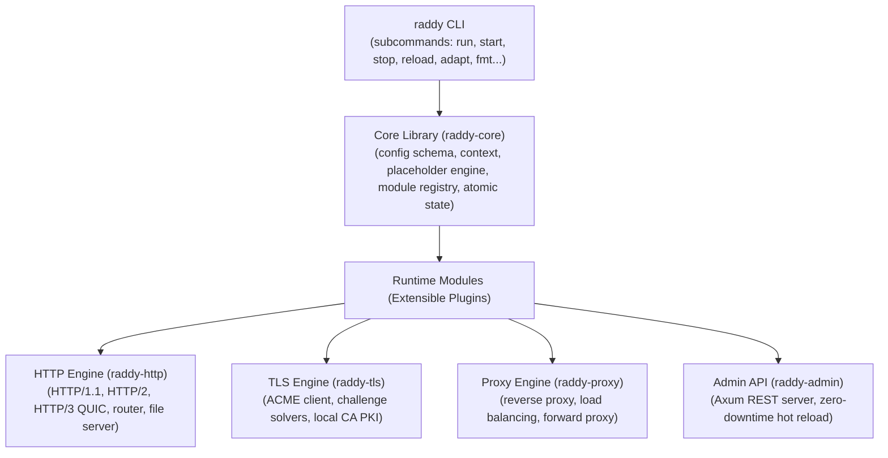

# Chapter 1: Architecture & Core Runtime (`raddy-core`)

## 1. System Overview & The Three Pillars

**Raddy** is an extensible, memory-safe, and high-performance web server and reverse proxy written in modern Rust, designed as a drop-in replacement for Caddy. Its architecture is built upon three foundational pillars:



### Module Lifecycle
Modules in Raddy follow a deterministic lifecycle:
```text
Compile-Time Registration -> Instantiation -> Provisioning -> Validation -> Serving -> Cleanup
```

1. **Registration**: Modules register themselves at compile time using `inventory::collect!`.
2. **Instantiation**: The `ModuleRegistry` parses the module configuration from the JSON model.
3. **Provisioning**: Handlers allocate required resources (connection pools, file handles, template engines).
4. **Validation**: Configurations are checked for semantic validity before binding.
5. **In Service**: Handlers process incoming `Context` asynchronously.
6. **Cleanup**: Dropped gracefully when an atomic configuration swap occurs.

---

## 2. Go-to-Rust Paradigm Mappings

Raddy matches Caddy's ergonomics while leveraging Rust's zero-cost abstractions:

| Caddy (Go) Architecture | Raddy (Rust) Implementation | Performance & Safety Benefits |
|---|---|---|
| Goroutines per connection | `tokio::spawn` lightweight green tasks | Predictable scheduling, minimal stack overhead |
| `sync.Map` & `atomic.Value` | `arc_swap::ArcSwap<Config>` | Wait-free, lock-free reads during configuration swaps |
| Go `init()` self-registration | `inventory` distributed registry | Zero central coordination, fully compile-time verified |
| Interface polymorphism (`caddy.Module`) | Rust traits (`Handler`, `Matcher`, `PlaceholderProvider`) | Dynamic trait objects with static dispatch where possible |
| Garbage collector (GC) | RAII and explicit ownership | Eliminates tail-latency spikes and GC stop-the-world pauses |

---

## 3. Configuration Model (`raddy_core::config`)

The configuration tree is structured as a declarative, JSON-serializable model mirroring Caddy's native schema:

- **`Config`**: The root configuration object containing `admin`, `logging`, and `apps`.
- **`HttpApp` & `HttpServer`**: Configures network listeners (`listen: [":80", ":443"]`), TLS connection policies, auto-HTTPS rules, and supported protocols (`h1`, `h2`, `h3`).
- **`Route`**: An ordered routing node containing:
  - `match`: A set of conjunction matchers (`MatcherSet`).
  - `handle`: An ordered pipeline of handler configurations (`HandlerConfig`).
  - `terminal`: Flag indicating whether execution stops after this route.
  - `group`: Named group for mutual exclusivity among alternative routes.

---

## 4. Request Context & Placeholder Engine (`raddy_core::context`, `raddy_core::placeholder`)

### Request Context
`Context` encapsulates the lifecycle of an individual HTTP exchange:
- Original and rewritten URI (`uri`, `orig_uri`).
- Request method (`method`, `orig_method`).
- Incoming and outgoing HTTP headers.
- Client socket address (`remote_addr`) and TLS Server Name (`server_name`).
- User-defined context variables (`vars`).
- Response status code and response body stream.

### Dynamic Placeholders
Raddy provides full placeholder interpolation (`eval_placeholders`):
- **Network**: `{host}`, `{remote_host}`, `{remote_port}`, `{client_ip}`, `{scheme}`.
- **HTTP Request**: `{path}`, `{method}`, `{orig_method}`, `{query}`, `{query.*}`, `{header.*}`, `{cookie.*}`.
- **HTTP Response**: `{resp.header.*}`.
- **URI Path Decomposition**: `{dir}`, `{file}`, `{file.base}`, `{file.ext}`.
- **Domain Labels**: `{labels.*}` with right-to-left 0-based domain indexing (e.g. `{labels.0}` = TLD).
- **Errors**: `{err.status_code}`, `{err.status_text}`, `{err.message}`.
- **Custom & Environment**: `{vars.*}`, `{env.*}`.

---

## 5. Matcher Engine (`raddy_core::matcher`)

Request routing is driven by composable matchers evaluated in conjunction (AND):

- **Path Matchers**: Exact matching, prefix matching (`/api/*`), and glob matching.
- **Regex Matchers**: `path_regexp` and `header_regexp` with named capture extraction into context variables.
- **Virtual Host Matchers**: `HostMatcher` supporting exact hosts and wildcard domains (`*.example.com`).
- **Client IP Matchers**: `RemoteIpMatcher` supporting IPv4/IPv6 addresses, CIDR ranges (`10.0.0.0/8`), and the `private_ranges` alias.
- **Query Matchers**: Key-value query parameter matching.
- **Protocol Matcher**: Protocol scheme verification (`http`, `https`, `grpc`).
- **Context Variable Matchers**: `vars` and `vars_regexp`.
- **File Matcher**: `try_files` existence checks on disk with `split_path` support.
- **Inversion Matcher**: `not` wrapper supporting logical NOT on any matcher.

---

## 6. Atomic Hot Reload (`raddy_core::state`)

Configuration state is managed by `AppState`:
- Backed by `ArcSwap<Config>`.
- Request worker threads read the active configuration without acquiring locks.
- Reloading atomically swaps the `Arc<Config>` pointer: active in-flight requests continue executing with their retained configuration instance, while new incoming connections immediately execute the new configuration.
