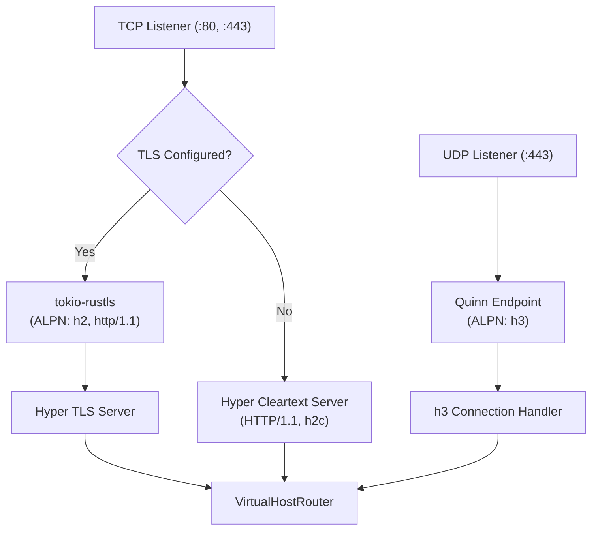

# Chapter 3: HTTP Engine & Multi-Protocol Transport (`raddy-http`)

## 1. Multi-Protocol Engine

`raddy-http` provides a modern, asynchronous protocol engine built on **Tokio**, **Hyper**, **Quinn**, and **h3**, delivering complete protocol parity with Caddy:

- **HTTP/1.1**: Persistent keep-alive connections, chunked transfer encoding, and pipelining.
- **HTTP/2**: Multiplexed binary framing over cleartext (`h2c`) and TLS with ALPN negotiation (`h2`).
- **HTTP/3 over QUIC**: High-speed UDP-based transport with native streams, zero-RTT connection resumption, and automated `Alt-Svc: h3=":443"` header advertisement.

---

## 2. Server Architecture & Connection Lifecycle

### Protocol Negotiation
- Incoming TLS connections advertise `h2` and `http/1.1` via ALPN.
- Outgoing responses over TLS automatically include the `Alt-Svc` header to inform clients that HTTP/3 over QUIC is available on UDP port 443.

---

## 3. VirtualHostRouter & Request Dispatch

Incoming requests are converted into a unified `Context` and dispatched through the routing pipeline:

1. **Virtual Host Selection**: Evaluates the request host and port against defined `HttpServer` instances.
2. **Route Matchers**: Tests conjunction matchers (`host`, `path`, `method`, `header`, `remote_ip`, etc.).
3. **Route Grouping**: Enforces mutual exclusivity within route groups (e.g. `handle` and `handle_path` blocks).
4. **Handler Chain Execution**: Invokes handlers in sequential priority until a terminal response is generated.
5. **Error Pipeline**: If an unhandled error occurs, `handle_errors` routes intercept the context and render custom status pages.

---

## 4. Static File Server (`raddy_http::fileserver`)

The built-in file server provides zero-copy static asset delivery:

- **Zero-Copy Streaming**: Non-blocking asynchronous file streaming via `tokio::fs`.
- **Directory Browsing (`browse`)**: Generates responsive, mobile-friendly HTML listings with breadcrumb navigation and human-readable file sizes.
- **Relative Path Resolution**: Preserves `orig_uri` under path-rewriting directives like `handle_path`.
- **Trailing Slash Redirection**: Automatically issues a 308 redirect when directories are requested without a trailing slash.
- **Hide Directive**: Excludes sensitive files (e.g. `.git`, `.env`) from directory browsing and denies direct access.
- **MIME Type Inference**: Fast content-type mapping using `mime_guess`.
