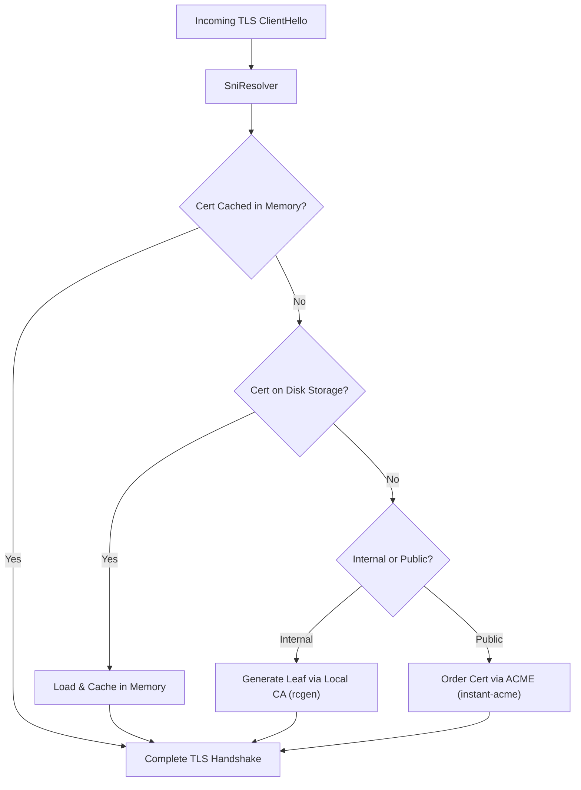

# Chapter 4: Automated TLS & Certificate Management (`raddy-tls`)

## 1. Automated HTTPS Architecture

Raddy provides fully automated, zero-touch certificate provisioning and lifecycle management via ACME:

---

## 2. ACME Client & Challenge Solvers

- **ACME Client (`instant-acme`)**: Interacts with ACME v2 endpoints (Let's Encrypt, ZeroSSL, or custom CAs) using ECC P-256 keys.
- **TLS-ALPN-01 Solver (RFC 8737)**: Solves challenges over port 443 using the custom TLS extension `id-pe-acmeIdentifier` with zero disruption to active HTTP traffic.
- **HTTP-01 Solver**: In-memory challenge store (`Http01ChallengeStore`) that intercepts token requests at `/.well-known/acme-challenge/*` on port 80.
- **Automatic HTTP-to-HTTPS Redirection**: Automatically generates a cleartext HTTP listener on port 80 that performs 308 permanent redirects to HTTPS.

---

## 3. Embedded Local CA (`raddy_tls::local_ca`)

For local development and private internal networks (`tls internal`):
- Automatically provisions a root CA certificate and private key.
- Generates and signs leaf certificates dynamically for local hosts (`localhost`, `*.local`, `*.internal`, IP addresses).
- Exposes root CA certificates via the Admin API (`GET /pki/ca/local`) for easy client installation.

---

## 4. Dynamic SNI Resolution & Storage

- **`SniResolver`**: Implements `tokio_rustls::rustls::server::ResolvesServerCert` with lock-free concurrent lookups.
- **File Storage**: Persists certificates, private keys, and ACME account credentials in `~/.local/share/raddy/certificates/` with safe file permissions (`0600`).
- **Lazy Provisioning**: Loads certificates into memory on first connection and initiates background renewals before expiration.
